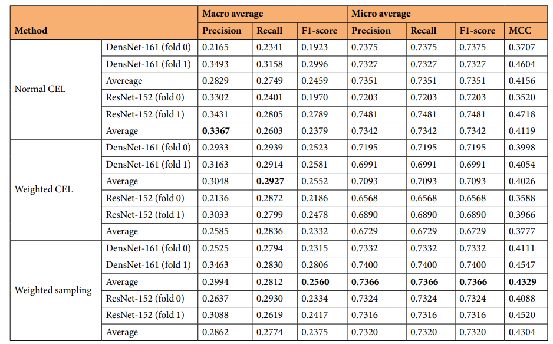
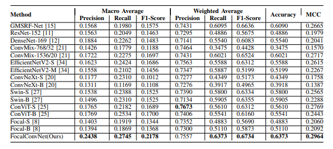

# CSC490 report 

## Group name
Team Aquafina

## Team member names
Han Xian Xu Huang, Yuliang Wang, Zhenyu Zhao

## Distribution of responsibilities in the group
1. Understand the papers
2. Setup two ML models
3. Build the training models and algorithms
4. Lower data processing time on high-resolution images
5. Apply our algorithms to actual medical images other than the dataset
6. Test the accuracy of the training models and algorithms
7. Compare the results we get to the results mentioned in the papers
8. Improve the accuracy of the machine learning algorithm
9. Look for methods to augment the machine learning algorithms
10. Explore the possibility of using generative models to abate the class imbalance as mentioned in the paper

## Name of the dataset
The Kvsair-Capsule Dataset

## Paper references
1. Smedsrud, P.H., Thambawita, V., Hicks, S.A. et al. Kvasir-Capsule, a video capsule endoscopy dataset. Sci Data 8, 142 (2021). https://doi.org/10.1038/s41597-021-00920-z

2. Srivastava, A., Tomar, N. K., Bagci, U., & Jha, D. (2022). Video Capsule Endoscopy Classification using Focal Modulation Guided Convolutional Neural Network. arXiv. 
https://doi.org/10.48550/arXiv.2206.08298

## Location of the dataset
https://osf.io/dv2ag/

## Reason
1. It is the largest publicly released VCE(video capsule endoscopy) dataset. 
2. Since the dataset already has all the images labelled and has been classified by diseases, we can save time on understanding the medical backgrounds of this project and label the images ourselves. Instead, we can dive into the machine learning algorithms and try our best to optimize the accuracy.
3. Since the dataset has a broad application field, it’s possible to identify many different diseases. Therefore, we hope to utilize the dataset and apply our model to the real medical area to help more people.
4. As mentioned in paper 1, the unlabelled data is well suited for semi-supervised and unsupervised machine learning methods.
5. There are two papers on this dataset. Although the results for all classification experiments are quite different, we can try using both of their methods and choose the one that best suits our needs.

Results from paper 1:

Results from paper 2:

## Who has started to access(download) the dataset
Zhenyu Zhao, Han Xian Xu Huang, Yuliang Wang

## Who is setting up the source code repo
Zhenyu Zhao, Han Xian Xu Huang, Yuliang Wang

## Distribution of tasks for this report
Han Xian Xu Huang: Use the model in the first paper to train the dataset. Use graphs to display the results.
Zhenyu Zhao: Use the model in the second paper to train the dataset. Use graphs to display the results.
Yuliang Wang: Based on the results provided by the two training models, do some analysis to determine potential project topics and prepare for the presentation. 
