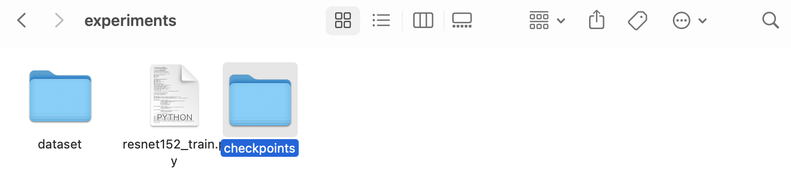

## Classfication Model
Our classification model is stored in CSC490/kvasir-capsule/. We use ResNet-152 to do the classfication.

## Data Distribution
All the training sets and validation sets are stored in the data folder. 

- train folder includes five classes, each class includes 100 images from the original dataset.
- train_gan folder includes five classes, each class includes 80 images from the original dataset and 20 images generated by GAN.
- train original and GAN include five classes, each class includes 100 images from the original dataset and 20 images generated by GAN.
- valid folder is the validation set for all three training sets. This folder include five classes, each class includes 100 images from the original dataset.

## Installation
- For DCGAN, install all packages specified in CSC490/gan/requirements.txt
- For ResNet-152, install all packages specified in CSC490/kvasir-capsule/requirements.txt

## Usage (generate new images using DCGAN)

**All commands should be run in CSC490/gan/dcgan/. Change line 120 of dcgan.py to use different CATEGORIES.**

~~~bash
python dcgan.py
~~~

## Usage (run classification using ResNet-152)
#### ***Train***
*** 
**All commands should be run in CSC490/kvasir-capsule/experiments/ as resnet152_train.py is inside that folder.**

~~~bash
python resnet152_train.py --data_train_folder ../data/train train
~~~
This command is used to train the model which use 500 images from the original dataset.

~~~bash
python resnet152_train.py --data_train_folder ../data/train_gan train
~~~
This command is used to train the model which uses 400 images from the original dataset and another 100 images generated by GAN.

~~~bash
python resnet152_train.py --data_train_folder ../data/train\ original\ and\ GAN train
~~~
This command is used to train the model which uses 500 images from the original dataset and another 100 images generated by GAN.

#### **Test**
***
> The model is too large to upload directly to GITHUB, so we put themin GOOGLE DRIVE.
>
> Here is the link: https://drive.google.com/file/d/19sGgp_Q9K-or73mADd3_ognJUxRfzGQG/view?usp=sharing
>
> You should download and unzip them in the expriment folder.
>
> Here is the example:
>
> 

**After running these three commands it will create three checkpoints in the checkpoint folder. And we will use it to test the model.**

~~~bash
python resnet152_train.py --test_checkpoint ./checkpoints/checkpoints0.pt test
~~~
This command is used to test the model which uses 500 images from the original dataset.

~~~bash
python resnet152_train.py --test_checkpoint ./checkpoints/checkpoints1.pt test
~~~
This command is used to test the model which uses 400 images from the original dataset and another 100 images generated by GAN.

~~~bash
python resnet152_train.py --test_checkpoint ./checkpoints/checkpoints2.pt test
~~~
This command is used to test the model which uses 500 images from the original dataset and another 100 images generated by GAN.

## Reference
- https://www.kaggle.com/code/waltermaffy/dcgan-with-keras/notebook#GAN
- https://github.com/eriklindernoren/Keras-GAN/tree/master/dcgan
- https://github.com/simula/kvasir-capsule

## Contribution
***Zhenyu Zhao:***
- Create training set and validation set for both models
- Read papers
- Train the classfication model
- Train the GAN model
- Modify the images from the GAN model
- Compare results
- Make visual graphs
- Make poster
- Originze GitHub

***Han Xian Xu Huang:***
- Modify GAN so it takes and produces Kvasir-Capsule images
- Read papers
- Create training set for GAN
- Run GAN to generate different classes of images
- Make poster
- Originze GitHub

***Yuliang Wang:***
- Read papers 
- Collect and arrange papers
- Make poster

## License
[MIT](https://choosealicense.com/licenses/mit/)
